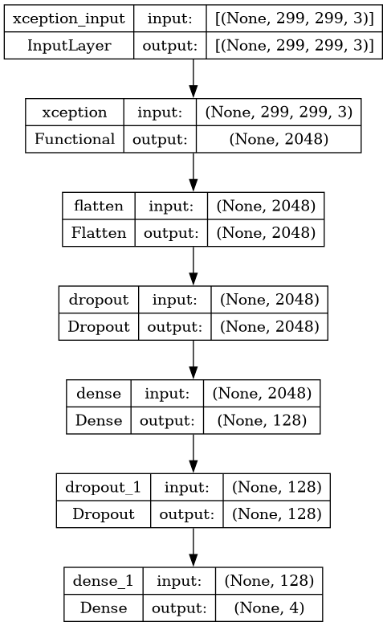
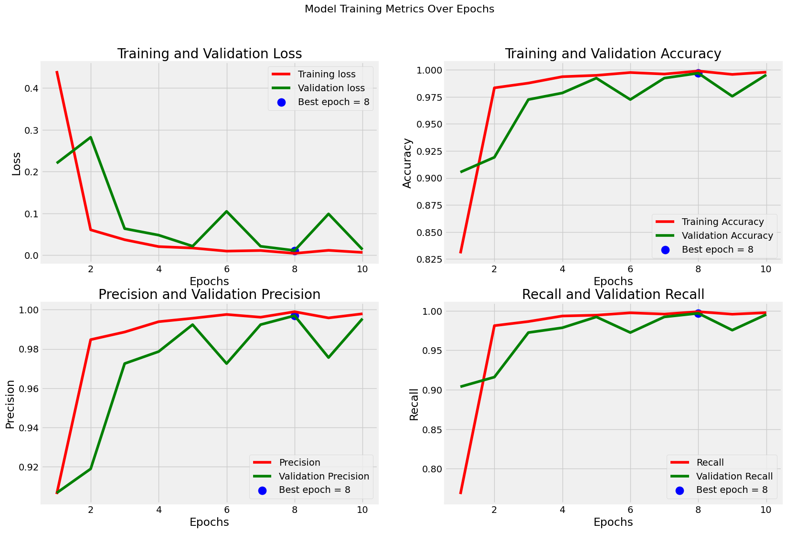

# 🧠 Brain Tumor Detection with Deep Learning and Grad-CAM

This project presents an end-to-end deep learning solution for brain tumor detection using MRI scans using deep learning. It combines a **CNN with a pretrained Xception backbone** for image classification, integrates **Grad-CAM** to visualize what the model "sees", and is deployed via a **Streamlit app** for real-time clinical use.

---

## 🧩 Problem Statement

Early and accurate diagnosis of brain tumors is critical for effective treatment planning and improving patient outcomes. Manual MRI interpretation is time-consuming and subject to human error. This project addresses that challenge by building an **AI-assisted system** that can automatically classify brain MRI scans and highlight regions of concern.

---

## 🎯 Objectives

- Build a robust CNN-based classifier using **transfer learning (Xception)**
- Achieve high accuracy on brain MRI data
- Use **Grad-CAM** to make the model explainable and clinically trustworthy
- Deploy the model using **Streamlit** for real-time image upload and prediction

---

## 🛠️ Technologies Used

- Python
- TensorFlow & Keras
- Xception (pretrained on ImageNet)
- OpenCV & Pillow
- Grad-CAM for explainability
- Streamlit for deployment

---

## 📊 Results

- **Training Accuracy:** 99%
- **Validation Accuracy:** 98.5%
- **Model Architecture:** Xception + Dense classifier
- **Explainability:** Grad-CAM highlights key tumor regions
- **Deployment:** Streamlit app accepts MRI images and shows prediction + heatmap

---

## 📊 Model Architecture

The model uses **Xception** as a feature extractor followed by custom dense layers.



---

## 📈 Training Results

The model achieved high performance across all metrics:

- **Training Accuracy:** 99%
- **Validation Accuracy:** 98.5%
- **Precision & Recall:** Above 98% consistently



---

## 🚀 How to Run

1. Install dependencies:
```bash
pip install -r requirements.txt
